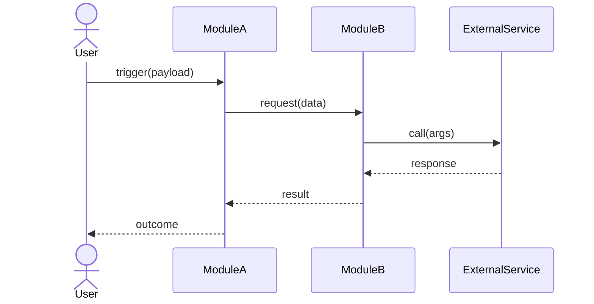
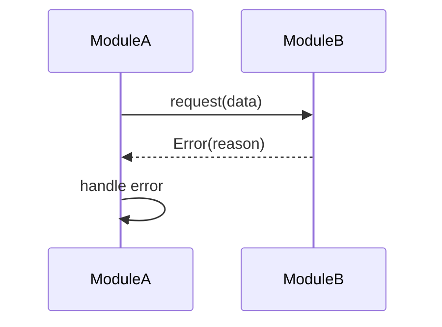
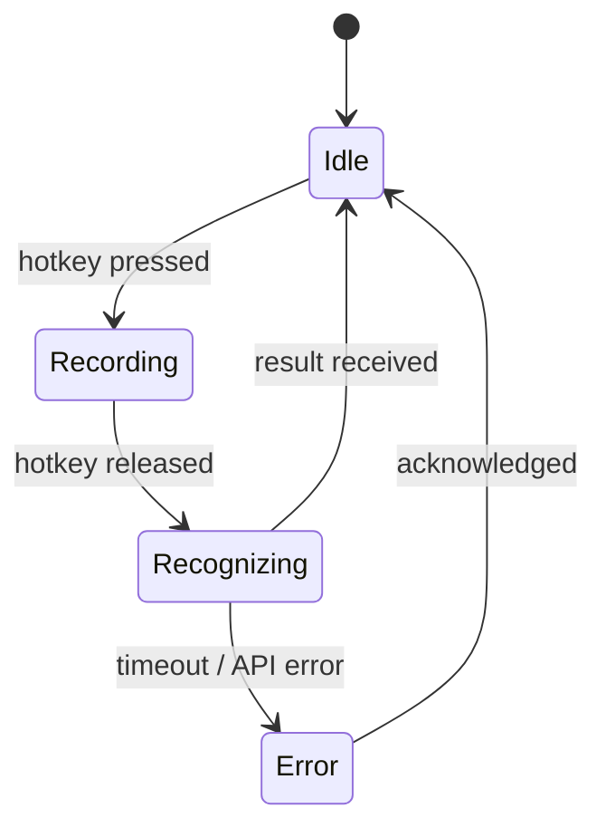

# [Feature Name] — Functional Spec (System Design)

**Version:** 0.1  
**Date:** YYYY-MM-DD  
**Related feature spec:** `feature-spec.md`  
**Status:** Draft | Review | Approved

---

## 1. Modules

<!-- One sub-section per logical module. -->

### 1.1 [Module Name]

**Responsibility:** One sentence.  
**Does NOT own:** What sibling modules handle instead.

### 1.2 [Module Name]

**Responsibility:**  
**Does NOT own:**

---

## 2. Data Flows

<!-- One diagram per scenario or async trigger. Use Mermaid sequenceDiagram or flowchart. -->

### 2.1 [Scenario Name]



### 2.2 [Scenario Name — Error Path]



---

## 3. Interaction Contracts

<!-- Function signatures, message shapes, API contracts. No implementation bodies. -->

### 3.1 [ModuleA → ModuleB]

```
// Function contract
function doSomething(param1: Type, param2: Type): ReturnType

// Event / message payload
{
  field1: Type,
  field2: Type
}
```

### 3.2 [ModuleB → ExternalService]

```
// HTTP / WebSocket / IPC shape
POST /endpoint
Authorization: Bearer <token>

Request body:
{
  key: string,
  data: bytes
}

Response (200):
{
  result: string,
  confidence: float
}
```

---

## 4. Business Logic

<!-- Rules that live inside a single module. Use state diagrams, decision tables, or numbered prose. -->

### 4.1 [Rule / State Machine Name]



### 4.2 [Decision Rule Name]

| Condition | Action |
|-----------|--------|
| condition A | do X |
| condition B | do Y |
| otherwise | do Z |

---

## 5. Integration Points

| Entity | Type | Access pattern | Owner module |
|--------|------|----------------|-------------|
| ExternalService API | REST over HTTPS | request/response per recording | ModuleB |
| config.json | local file | read at startup, write on save | SettingsModule |
| OS Clipboard | system API | write-only, per insertion | InsertModule |

---

## 6. Open Questions

<!-- Unresolved decisions that need owner sign-off before implementation. -->

- [ ] Question 1 — who decides?
- [ ] Question 2 — deadline?
