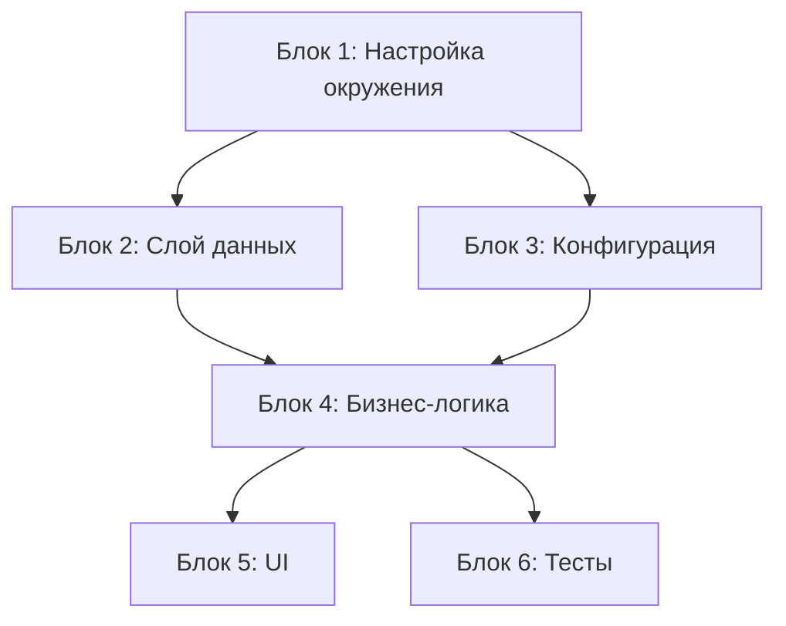

# [Feature Name] — Implementation Plan (План реализации)

**Версия:** 0.1  
**Дата:** YYYY-MM-DD  
**Источник решения:** 
- `research.md`
- `path/to/feature-spec.md`
**Статус:** Draft | Approved

---

## 1. Зависимости и конфигурация

<!-- Финальный список из research.md. Не пересматривается. -->

| Библиотека / Пакет | Версия | Команда установки | Назначение |
|---|---|---|---|
| example-lib | 1.2.3 | `npm install example-lib@1.2.3` | краткое описание |

**Ключевые конфигурационные параметры:**

```
PARAM_NAME=value        # назначение
OTHER_PARAM=value       # назначение
```

---

## 2. Декомпозиция и последовательность

<!-- Граф зависимостей (если зависимостей много) -->



---

### Блок 1: [Название]

**Критичность:** Критично / Важно / Желательно  
**Оценка:** S / M / L / XL  
**Зависит от:** —

- [ ] 1.1 Создать файл `path/to/file.ts` — краткое описание
- [ ] 1.2 Изменить класс `ClassName` в `path/to/file.ts` — добавить метод `methodName(param: Type): ReturnType`
- [ ] 1.3 Настроить `config-key` в `config.json`

---

### Блок 2: [Название]

**Критичность:** Критично / Важно / Желательно  
**Оценка:** S / M / L / XL  
**Зависит от:** Блок 1

- [ ] 2.1 Создать `path/to/module.ts` — краткое описание
- [ ] 2.2 Реализовать контракт `InterfaceName` из `functional-spec.md` раздел X.Y
- [ ] 2.3 Добавить обработку ошибки `ErrorType`

---

### Блок 3: [Название]

**Критичность:** Критично / Важно / Желательно  
**Оценка:** S / M / L / XL  
**Зависит от:** Блок 1

- [ ] 3.1 …
- [ ] 3.2 …

---

<!-- Добавить блоки по необходимости -->

---

## 3. Параллельные потоки

<!-- Блоки, которые можно выполнять одновременно. Если параллелизм невозможен — написать об этом. -->

| Поток | Блоки | Условие старта |
|---|---|---|
| Поток A | Блок 2, Блок 4 | После завершения Блока 1 |
| Поток B | Блок 3, Блок 5 | После завершения Блока 1 |

---

## 4. Критический путь

<!-- Самая длинная последовательная цепочка зависимостей. -->

Блок 1 → Блок 2 → Блок 4 → Блок 6

Минимальное время (при параллельном выполнении потоков): **N единиц**

---

## 5. Открытые вопросы

<!-- Нерешённые моменты, требующие ответа до начала реализации. -->

- [ ] Вопрос 1 — кто решает?
- [ ] Вопрос 2 — срок?
